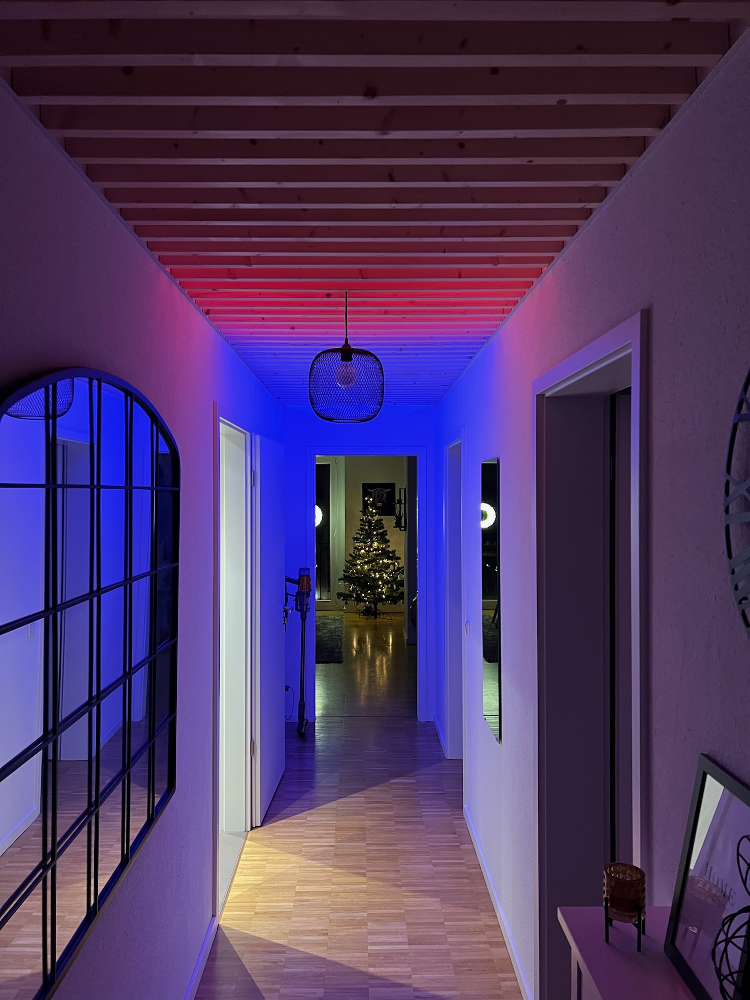
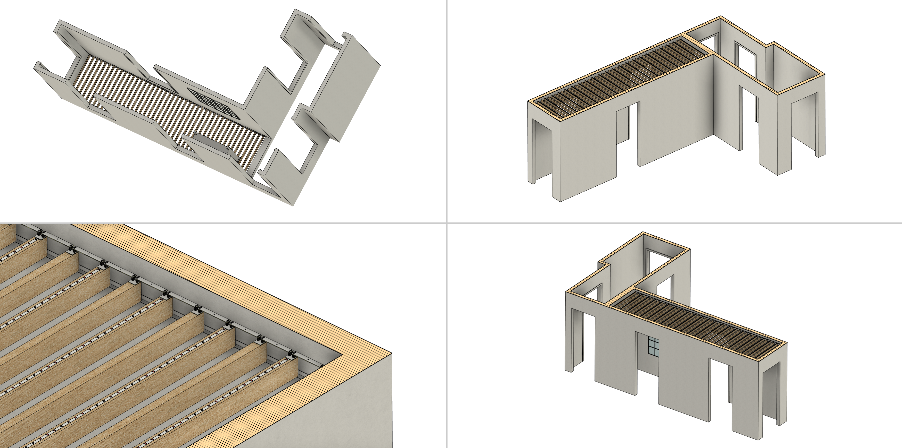
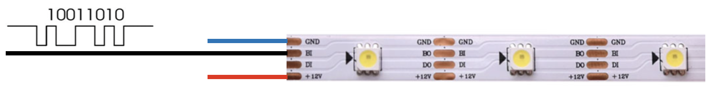
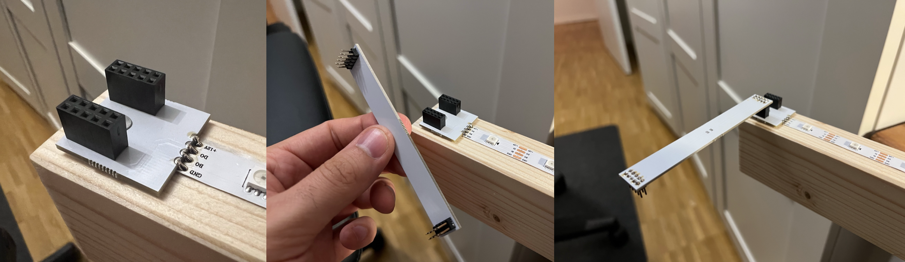
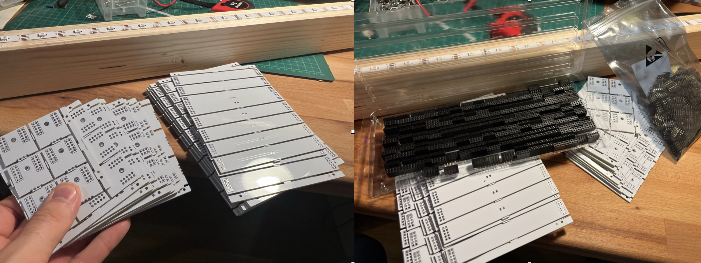

# Luminous Hallway

Mit der letzten Sommersaison überkam mich der Wunsch, unseren dunklen und länglichen Flur in ein farbenfrohes Lichtermeer zu verwandeln. Dabei sollte der grundlegende Aufbau jedoch auch bei ausgeschaltetem Licht ansprechend aussehen. Mehrere hölzerne Querbalken in einem geringen Abstand zur Decke schaffen beim Durchqueren des Flures einen schönen Tiefeneffekt. Auf der Oberseite der Holzbalken beleuchten mehr als 700 LEDs die Decke. Als technische Challenge sollte der Anwender die indirekte Deckenbeleuchtung frei gestalten können. Hierfür kann entweder ein statisches Bild oder ein Video verwendet werden, welches Frame für Frame an die Decke gerendert wird. Dies ermöglicht es auch, eigene Szenen mit simplen Bild- oder Videoprogrammen zu gestalten. Werden die LEDs ausgeschaltet, bleibt der rustikale Look der Holzbalken, die dem Raum einen interessanten Look verleihen. Ich persönlich bevorzuge bewegte Szenen, welche man einfach über YouTube-Videos wie dieses [hier](https://www.youtube.com/watch?v=XGJ8TnWDTdw) ableiten kann.



## Deckendesign

Die Decke besteht insgesamt aus 44 Holzbalken und 748 LEDs. Aufgrund der hohen Modulleistung von 0,3 W pro LED genügte die Bestückung jedes zweiten Balkens. Auf jedem der entsprechend 22 bestückten Balken sind 34 einzeln ansteuerbare LEDs verbaut.

Mit einem Gesamtgewicht von über 60 kg ist die Aufhängung der Balken besonders faszinierend.



Diese sind lediglich lose auf zwei 10x10 mm Aluwinkel aufgelegt, welche wiederrum mit feinen Nägeln an der Wand montiert sind. Zweifelt man hier zunächst an der Festigkeit, da sich die Aluleisten bei der Montage selbst nach einer nur seichten Berührung von der Wand lösten, stabilisiert sich das Gesamtsystem durch einen einfachen Formschluss. Über die Länge des Flures sind die Holzbalken jeweils so in ihrer Länge eingepasst, dass die Alu-Winkel sich nicht von der Wand lösen können. In der Folge werden die Nägel ausschließlich durch entsprechende Scherkräfte belastet. Trotz Durchmesser < 1 mm reicht die Festigkeit der Nägel zum Tragen des Gesamtgewichtes. Die Aufhängung ist somit durch wenige feine Nägel realisiert, wodurch sich das Gesamtsystem spielend leicht demontieren lässt.

## Benutzeroberfläche

Die Benutzeroberfläche ist Ergebnis einer HTML5 Webanwendung, die von einem Server im Heimnetzwerk gehostet wird. Dabei skaliert sich die Anwendung mit der Bildschirmgröße und kann somit auch auf mobilen Geräten angezeigt und genutzt werden. Ein weiteres technisches Highlight ist die Live-Synchronisation von Clients. So können sich im Heimnetzwerk mehrere Geräte zugleich mit dem Backend verbinden. Ändert zum Beispiel ein Anwender die Helligkeit, wird dieser Zustand in Echtzeit auf alle weiteren Geräte übertragen. Somit sind die physische Decke und das virtuelle Abbild auf allen Geräten stets synchronisiert.

https://github.com/mgiesen/Luminous-Hallway/assets/29503989/0687be9d-3882-4a09-bc49-a3099147967d

## Backend

Das Backend ist ein NodeJS Skript, welches auf meinem Heimserver läuft. Anstelle eines Heimservers kann jedoch auch ein einfacher Raspberry Pi verwendet werden. Wird vom Anwender ein Video hochgeladen, wird dieses zunächst mittels [ffmpeg](https://ffmpeg.org) in seine einzelnen Frames aufgeteilt und auf die relative Auflösung der Decke skaliert. Die Video-Frames bzw. das Einzelbild wird dann in ein Daten-Array überführt, welches über eine Schnittstelle an einen Mikrokontroller übertragen wird. Dieser übernimmt dann die Aufgabe der Ansteuerung der LEDs. Im Rahmen der Entwicklung habe ich mehrere Schnittstellen getestet und alle als Wahl-Option im Projekt erhalten, da es unterschiedliche Vor- und Nachteile je Anwendung gibt. Die im Projekt enthaltenden Schnittstellen sind:

- UDP
- TCP/IP WebSockets
- Serielle Schnittstelle (USB-UART)

## Mikrocontroller

Auch beim Mikrocontroller habe ich den Code sowohl für einen ESP8266 und einen ESP32 vorbereitet, da beide weit verbreitet sind und genutzt werden können. Ein Performance Test steht noch aus, aber es ist davon auszugehen, dass der ESP32 die Signale schneller an die LEDs übertragen kann. Zur Ansteuerung der LEDs ist ein Level-Shifting von den ESP typischen 3,3 V auf 12 V notwendig. Aktuelle arbeite ich noch an einem integrierten Schaltkreis inkl. Gehäuse, da mein Prototyp auf einem Breadboard ausgeführt ist.

## LEDs

Basis für die Beleuchtung sind die bekannten adressierbaren LED-Streifen WS2815. Diese ermöglichen das setzen der Farbe jeder einzelnen LED über ein digitales Signal.



Die LEDs haben jeweils eine Leistung von 0,3 W. Das bedeutet bei 748 LEDs eine Gesamtleistung von ca. 224 W. Die WS2815 sind bei diesem Projekt aufgrund ihrer verhältnismäßig hohen Betriebsspannung von 12 V zu bevorzugen. Dennoch ergibt sich entsprechend ein Maximalstrom von ca. 20 Ampere. Eine der wichtigen entwicklungstechnischen Fragen war, wie die 22 LED Streifen auf einer Installationshöhe von > 2 m miteinander verbunden werden können. Bei jeweils 8 Lötstellen war klar, dass ein Löten auf Arbeitshöhe unpraktikabel ist. Auch ist es nicht möglich mehrere Balken vorkonfektioniert auf den Winkel aufzulegen. Somit musste ein Stecksystem entwickelt werden, welches einerseits kostengünstig ist und zugleich den hohen Arbeitsstrom von 20 A aushält. Neben der elektrischen Verbindung wollte ich die Steckverbindung nutzen, um die lose aufgelegten Balken in Längsposition zu fixieren, da unterschiedliche Balkenabstände beim durchqueren des Flures schnell auffallen würden.

Entsprechend habe ich mich für zwei selbst designte PCBs mit standardisierten Pin-Headern entschieden. Über den PCB-Fertiger [JLCPCB](https://jlcpcb.com) konnte ich mir meine PCBs sehr kostengünstig anfertigen lassen.

Einfach ausgeführte Pin Header sind maximal tolerant für einen Strom von ca. 3 Ampere. Daher habe ich mich für einen 10 Pin Header entschieden mit 4 x GND, 4 x VCC und 2 x Data. Entsprechend kann ich über eine Leiterbrücke ca. 12 A übertragen. Durch eine symmetrische Ausführung komme ich schlussendlich auf 24 A, die von dem Stecksystem übertragen werden können. Das Brücken-PCB zwischen zwei Balken führt GND auf der Unterseite und VCC auf der Oberseite, ausgenommen von einer schmalen Leiterbahn für die Daten. Mit einer Kupfermenge von 1 oz/ft² und einer Brückenbreite von 10 mm sind auch die PCBs in der Lage, dem hohen Strom zu widerstehen.



Zur Steuerung der LEDs nutze ich [FastLED](https://fastled.io), generiere aber das zugrundeliegende Integer-Array bereits im Backend, sodass der Mikrocontroller möglichst wenig mathematische Operationen übernehmen muss.

## Fehler passieren

Nachdem ich bei der Entwicklung viel Wert auf eine einfache Montage gelegt hatte, trafen Kostenbewustsein und der natürliche Wunsch nach Einfachheit in Konflikt. Mein Plan war es die PCBs direkt beim Fertiger bestücken zu lassen, sodass ich lediglich die PCBs und die LED Streifen hätte verlöten müssen. Leider vergaß ich im Eifer des Gefechtes einen Haken an der richtigen Stelle und so bekam ich PCBs und Pin Header als Einzelteile. Schlussendlich wollte ich das Material nicht doppelt bezahlen und auch nicht erneut knapp drei Wochen auf die Teile warten. Somit habe ich schlussendlich mit fleißiger Unterstützung meiner Frau alle Pin Header per Hand verlötet. Jeder Balken besteht aus folgenden Löstellen:

- 40 Stück am LED-PCB
- 8 Stück am LED streifen (nur an jedem zweiten Balken)
- 40 Stück am Brücken-PCB (ausgenommen dem ersten und letzten Balken)

Überschlagen kommen wir demnach auf 3.700 händische Lötstellen. Daran sieht man gut, welch gravierende Auswirkung auch nur kleine Fehler bei einer Bestellung haben können.



## Transformation der Bilddaten auf die LEDs

Um überhaupt Bilddaten mit einer hohen Wiederholrate auf eine LED Matrix zu übertragen, ist eine effiziente Verarbeitung der Daten von entscheidender Bedeutung. Zur Entlastung des verhältnismäßig langsamen Mikrocontrollers, übernimmt der Server die Vorverarbeitung der hochgeladenen Bilder bzw. Video-Frames.

Die initiale Verarbeitung beinhaltet die Konvertierung des Bildes oder Video-Frames in einen standardisierten sRGB-Farbraum und das Speichern der Daten als Rohdaten (Buffer). Jeder Pixel wird durch seine RGB-Werte repräsentiert. Die Rohdaten folgen dem Row-Major-Format, d.h., die Pixel sind zeilenweise hintereinander im Array angeordnet.

```javascript
const imageBuffer = await sharp(`./program/${image}`).toColorspace("srgb").raw().toBuffer();
```

Die physische Anordnung der LEDs in unserer Installation erfordert eine spezielle Datenorganisation. Die LEDs sind in Spalten angeordnet und wechseln mit jedem Balken ihre Ausrichtung. Um diese Struktur abzubilden, muss das ursprünglich im Row-Major-Format vorliegende Array umsortiert (transformiert) werden.

### Funktionsweise der Transformationsfunktion:

- Ein neues Array result wird erstellt, um das umgeordnete Datenarray aufzunehmen.

- Die Funktion iteriert über jede Spalte (col) und dann über jede Reihe (row).

- Für gerade Spaltennummern (col % 2 === 0) wird die Reihenfolge der Reihen beibehalten, während sie für ungerade Spaltennummern umgekehrt wird ((rows - 1) - row), um die alternierende Anordnung der LEDs widerzuspiegeln.

- Optional können die Spalten und Reihen gespiegelt werden. flip_x spiegelt die Pixelreihenfolge horizontal, während flip_y die Pixelreihenfolge vertikal spiegelt. Dies ist nützlich um die Darstellungsart der Benutzeroberfläche zu übernehmen. Die Notwendigkeit des spiegelns hängt davon ab, an welcher Stelle man die Datenleitung an den LED Balken anschließt.

- Jeder Pixel besteht aus drei Werten (Rot, Grün, Blau), daher wird eine innere Schleife verwendet, um diese drei Werte für jeden Pixel aus dem ursprünglichen Array zu extrahieren und in das neue Array result einzufügen.

```javascript
function transformMatrix(arr, rows, cols, flip_x, flip_y) {
	const result = new Uint8Array(rows * cols * 3);
	for (let col = 0; col < cols; col++) {
		for (let row = 0; row < rows; row++) {
			let sourceCol = flip_x ? cols - 1 - col : col;
			let alternateRow = sourceCol % 2 === 0 ? row : rows - 1 - row;
			let sourceRow = flip_y ? rows - 1 - alternateRow : alternateRow;

			for (let i = 0; i < 3; i++) {
				result[(col * rows + row) * 3 + i] = arr[(sourceRow * cols + sourceCol) * 3 + i];
			}
		}
	}
	return result;
}
```

Mit dem Upload der Bild- oder Videodaten erfolgt somit die Datenaufbereitung für die FastLED Library, sodass die hierfür erforderliche Matrix an den Mikrocontroller übertragen wird. Je nach Schnittstelle variiert die mögliche maximale Bildwiederholrate.

## Apple HomeKit

Im letztem Feinschliff habe ich über das Backend eine Apple HomeKit Schnittstelle emuliert, wodurch ich die Decke via Siri oder der Home-App auf einem Apple Gerät steuern kann. Somit ist ein Ein- und Ausschalten bequem genug, um die Decke auch im Alltag zu nutzen.

## Finales Ergebnis im Video

https://github.com/mgiesen/Luminous-Hallway/assets/29503989/7a764eb4-8cb4-48a4-9e3c-c0e4cb319569

## Fazit

Die Decke sieht beeindruckend aus und es macht Spaß Fotos und Videos zu identifizieren, die dem Flur wieder eine ganz eigene Note verleihen. Ich konnte zudem einige Skills auffrischen und neue Techniken erlernen.

## Nachbau

Für einen Nachbau des Projektes benötigt ihr neben den LEDs einen ESP8266 oder ESP32, sowie einen Computer, der NodeJS Skripte ausführen kann. Ich freue mich über Feedback oder die Weiterentwicklung des Repositorys. Solltet Ihr Fehler finden, erstellt gerne ein Issue oder sendet mir eine Nachricht.

## Projektinstallation und Ausführung des Servers

1. **Klonen des Repositories**  
   Klone das Repository mit dem folgenden Befehl:  
    `git clone https://github.com/mgiesen/Luminous-Hallway.git`

1. **Wechseln in Projektverzeichnis**  
   Wechsle in das Verzeichnis des geklonten Projekts:  
    `cd Luminous-Hallway/project`

1. **Konfiguration anpassen**  
   Bearbeite die Konfigurationsdatei im server-Ordner:  
   `./server/config.json`

1. **Installieren der Abhängigkeiten**  
   Installiere alle erforderlichen Pakete und Abhängigkeiten:  
    `npm install`

1. **Starten des Projekts**  
   Starte den Server mit:  
    `npm start`

## Vorbereitung und Upload der Firmware

1. **Passwortdatei m_secret.h anlegen**
   Erstelle eine Datei `m_secret.h` im Verzeichnis `ledDriverFirmware` mit folgendem Inhalt:

   ```
   #define SECRET_SSID ""
   #define SECRET_PASS ""
   #define SECRET_OTA_PASSWORD ""
   ```

1. **Programmkonfiguration m_handler.h anpassen**  
   Passe die Datei `m_handler.h` im ledDriverFirmware-Ordner auf deine Gegebenheiten an:
   `./ledDriverFirmware/m_handler.h`

1. **Quellcode auf MCU übertragen**  
   Lade den Quellcode auf deine Mikrocontroller-Einheit
