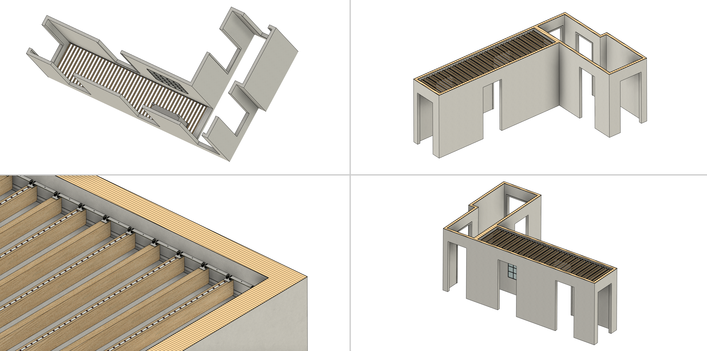
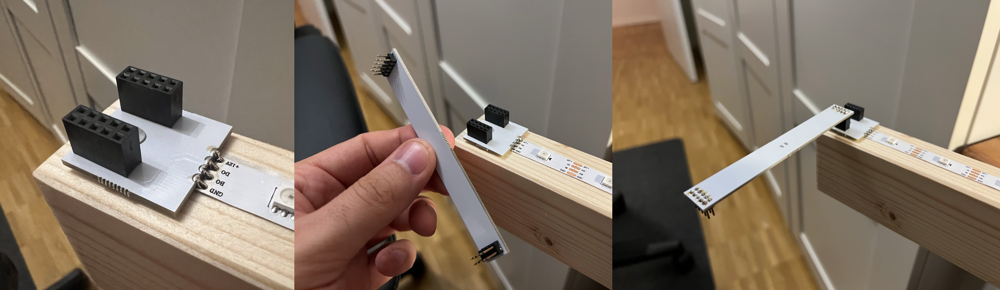

# Luminous Hallway

With the end of the last summer season, I had the urge to transform our dark and narrow hallway into a colorful sea of lights. However, the basic structure should also look appealing when the lights are off. Several wooden crossbeams, placed at a short distance from the ceiling, create a beautiful depth effect when walking through the hallway. On the top side of the wooden beams, more than 700 LEDs illuminate the ceiling. As a technical challenge, the user should be able to freely design the indirect ceiling lighting. This can be done using either a static image or a video, which is rendered frame by frame onto the ceiling. This also allows for custom scenes to be created using simple image or video editing software. When the LEDs are turned off, the rustic look of the wooden beams remains, giving the room an interesting appearance. Personally, I prefer moving scenes, which can easily be derived from YouTube videos like this [one](https://www.youtube.com/watch?v=qC0vDKVPCrw).


## Ceiling Design

The ceiling consists of 44 wooden beams and 748 LEDs in total. Due to the high module power of 0.3 W per LED, it was sufficient to equip every second beam. On each of the 22 equipped beams, there are 34 individually controllable LEDs installed.

With a total weight of over 60 kg, the suspension of the beams is particularly fascinating.



The beams are merely laid loosely on two 10x10 mm aluminum angles, which are mounted to the wall with fine nails. Initially, one might doubt the strength of this setup, as the aluminum strips detached from the wall after even a light touch during installation. However, the entire system stabilizes through a simple form-fit. The wooden beams are fitted along the length of the hallway so that the aluminum angles cannot detach from the wall. As a result, the nails are only subjected to shear forces. Despite having a diameter of less than 1 mm, the strength of the nails is sufficient to support the total weight. Thus, the suspension is realized with just a few fine nails, making the entire system easy to disassemble.

## User Interface

The user interface is the result of an HTML5 web application hosted by a server on the home network. The application scales with the screen size and can thus be displayed and used on mobile devices. Another technical highlight is the live synchronization of clients. This allows multiple devices in the home network to connect to the backend simultaneously. For example, if one user changes the brightness, this state is updated in real time on all other devices. This ensures that the physical ceiling and the virtual representation on all devices are always synchronized.

https://github.com/mgiesen/Luminous-Hallway/assets/29503989/0687be9d-3882-4a09-bc49-a3099147967d

## Backend

The backend is a NodeJS script running on my home server. However, a simple Raspberry Pi can also be used instead of a home server. When a video is uploaded by the user, it is first split into individual frames using [ffmpeg](https://ffmpeg.org) and scaled to the relative resolution of the ceiling. The video frames or single image are then converted into a data array, which is transmitted to a microcontroller via an interface. The microcontroller then takes over the task of controlling the LEDs. During development, I tested several interfaces, all of which are available as options in the project since they offer different advantages and disadvantages depending on the application. The included interfaces are:

- UDP
- TCP/IP WebSockets
- Serial Interface (USB-UART)

## Microcontroller

I also prepared the code for both an ESP8266 and an ESP32 microcontroller since both are widely used and can be utilized. Performance testing is still pending, but it is expected that the ESP32 can transmit signals to the LEDs faster. For controlling the LEDs, a level-shifting from the typical ESP 3.3 V to 12 V is necessary. I am currently working on an integrated circuit including a housing since my prototype is built on a breadboard.

## LEDs

The basis for the lighting is the well-known WS2815 addressable LED strips. These allow setting the color of each individual LED via a digital signal.


The LEDs each have a power consumption of 0.3 W. With 748 LEDs, this results in a total power of approximately 224 W. The WS2815 are preferred for this project due to their relatively high operating voltage of 12 V. Nevertheless, this results in a maximum current of about 20 amperes. One of the important development questions was how to connect the 22 LED strips at an installation height of more than 2 meters. With 8 soldering points per strip, it was clear that soldering at working height would be impractical. It was also not possible to preassemble multiple beams and place them on the angle bracket. Therefore, I had to develop a plug-in system that is both cost-effective and capable of handling the high working current of 20 A. In addition to the electrical connection, I wanted to use the plug connection to fix the loosely placed beams in their longitudinal position, as different beam distances would quickly become noticeable when walking through the hallway.

Thus, I opted for two self-designed PCBs with standardized pin headers. Through the PCB manufacturer [JLCPCB](https://jlcpcb.com), I was able to have my PCBs made very inexpensively.

Simple pin headers can tolerate a maximum current of about 3 amperes. Therefore, I opted for a 10-pin header with 4 x GND, 4 x VCC, and 2 x Data. This allows me to transmit about 12 A via a bridge PCB. By using a symmetrical design, I can ultimately transmit 24 A through the plug-in system. The bridge PCB between two beams carries GND on the underside and VCC on the top side, except for a narrow trace for the data. With a copper weight of 1 oz/ft² and a bridge width of 10 mm, the PCBs are also capable of withstanding the high current.



For controlling the LEDs, I use [FastLED](https://fastled.io), but the underlying integer array is already generated in the backend, so the microcontroller has to perform as few mathematical operations as possible.

## Mistakes Happen

After I put a lot of emphasis on easy installation during development, cost-consciousness and the natural desire for simplicity came into conflict. My plan was to have the PCBs assembled directly by the manufacturer, so I would only have to solder the PCBs and LED strips together. Unfortunately, in the heat of the moment, I forgot to check the right box, and so I received the PCBs and pin headers as separate parts. In the end, I didn’t want to pay for the materials again, nor wait another three weeks for the parts. So, with the diligent help of my wife, we manually soldered all the pin headers. Each beam consists of the following solder points:

- 40 on the LED PCB
- 8 on the LED strip (only on every second beam)
- 40 on the bridge PCB (except the first and last beam)

In total, we’re talking about approximately 3,700 manual solder points. This shows how even small mistakes in ordering can have a significant impact.


## Transformation of Image Data to the LEDs

In order to transmit image data to an LED matrix at a high refresh rate, efficient data processing is of crucial importance. To relieve the relatively slow microcontroller, the server handles the preprocessing of the uploaded images or video frames.

The initial processing includes converting the image or video frame to a standardized sRGB color space and saving the data as raw data (buffer). Each pixel is represented by its RGB values. The raw data follows the row-major format, meaning the pixels are arranged row by row in the array.

```javascript
const imageBuffer = await sharp(`./program/${image}`).toColorspace("srgb").raw().toBuffer();
```

The physical arrangement of the LEDs in our installation requires a specific data organization. The LEDs are arranged in columns, and their orientation alternates with each beam. To reflect this structure, the originally row-major formatted array must be rearranged (transformed).

### Functionality of the Transformation Function:

- A new array, `result`, is created to store the reordered data.
  
- The function iterates over each column (`col`) and then over each row (`row`).

- For even column numbers (`col % 2 === 0`), the row order remains as is, but for odd column numbers, the row order is reversed (`(rows - 1) - row`) to account for the alternating LED arrangement.

- Optionally, the columns and rows can be flipped. `flip_x` mirrors the pixel order horizontally, while `flip_y` mirrors the pixel order vertically. This is useful for matching the layout of the user interface. The need for flipping depends on where the data line is connected to the LED beams.

- Each pixel is represented by three values (red, green, blue), so an inner loop extracts these three values for each pixel from the original array and inserts them into the new `result` array.

```javascript
function transformMatrix(arr, rows, cols, flip_x, flip_y) {
    const result = new Uint8Array(rows * cols * 3);
    for (let col = 0; col < cols; col++) {
        for (let row = 0; row < rows; row++) {
            let sourceCol = flip_x ? cols - 1 - col : col;
            let alternateRow = sourceCol % 2 === 0 ? row : rows - 1 - row;
            let sourceRow = flip_y ? rows - 1 - alternateRow : alternateRow;

            for (let i = 0; i < 3; i++) {
                result[(col * rows + row) * 3 + i] = arr[(sourceRow * cols + sourceCol) * 3 + i];
            }
        }
    }
    return result;
}
```

Once the image or video data is uploaded, the data is processed for the FastLED library, which prepares the required matrix to be sent to the microcontroller. Depending on the interface used, the possible maximum frame rate varies.

## Apple HomeKit

In the final touch, I emulated an Apple HomeKit interface via the backend, allowing control of the ceiling via Siri or the Home app on an Apple device. This makes turning the lights on and off convenient enough for daily use.

## Final Result in Video

https://github.com/mgiesen/Luminous-Hallway/assets/29503989/7a764eb4-8cb4-48a4-9e3c-c0e4cb319569

## Conclusion

The ceiling looks impressive, and it is enjoyable to find photos and videos that give the hallway its own unique touch. I was also able to refresh some skills and learn new techniques.

## Rebuild

To recreate this project, you will need the LEDs, an ESP8266 or ESP32, and a computer capable of running NodeJS scripts. I welcome feedback and further development of the repository. If you find any issues, feel free to create one or send me a message.

## Project Installation and Execution of the Server

1. **Clone the repository**  
   Clone the repository using the following command:  
   `git clone https://github.com/mgiesen/Luminous-Hallway.git`

1. **Install PM2**  
   Before starting the Luminous-Hallway server, make sure PM2 is globally installed on your system. PM2 is a process manager for Node.js applications that helps keep your application running, automatically restarts it if it crashes, and allows easy management of application logs:  
   `npm install pm2 -g`

   Verify the installation with:  
   `pm2 --version`

1. **Navigate to the project directory**  
   Change into the project directory:  
   `cd Luminous-Hallway/project`

1. **Adjust configuration**  
   Adjust the configuration file according to your system environment in the server folder:  
   `./server/config.json`

1. **Install dependencies**  
   Install all required packages and dependencies:  
   `npm install`

1. **Start the project**  
   Start the server with:  
   `npm start`

1. **Stop the project**  
   Stop the server with:  
   `npm stop`

   You can also display and manage all PM2 Node instances using the following command:  
   `pm2 list`

## Preparing and Uploading Firmware

1. **Create password file `m_secret.h`**  
   Create a file `m_secret.h` in the `ledDriverFirmware` directory with the following content:

   ```c
   #define SECRET_SSID ""
   #define SECRET_PASS ""
   #define SECRET_OTA_PASSWORD ""
   ```
1. **Adjust program configuration `m_handler.h`**  
   Adjust the file `m_handler.h` in the `ledDriverFirmware` folder according to your setup. This file contains various settings related to the microcontroller's operation, including pin assignments, LED data protocols, and timing configurations. Modify these parameters to match your hardware setup and installation environment:
   `./ledDriverFirmware/m_handler.h`

1. **Upload the source code to the MCU**  
   Once you have adjusted the configuration files to your specific needs, upload the firmware to your microcontroller. You can do this using standard tools like the Arduino IDE or PlatformIO, depending on your development environment. Make sure your microcontroller is properly connected to your computer via USB or another appropriate method. After the code is uploaded, the microcontroller should be able to communicate with the LEDs and execute the commands from the server.

